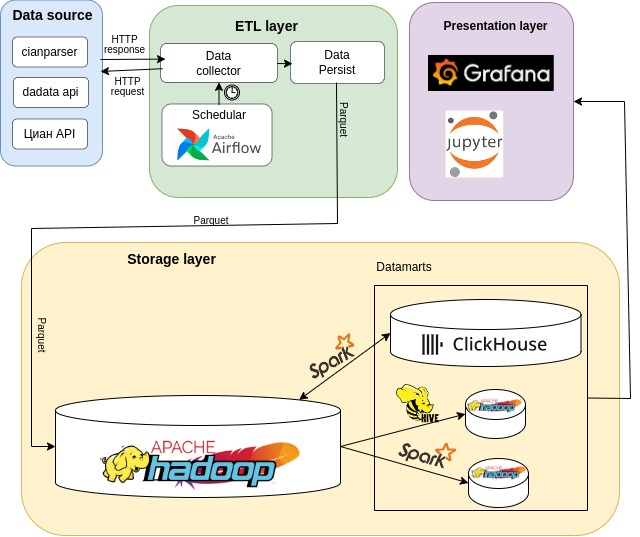
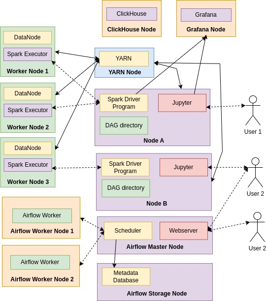

# Проект по анализу обьявлений Циан
Для запуска Hadoop infra/docker-hadoop-hive

        docker compose up

Для запуска clickhouse и grafana перейти по ссылке infra/clickhouse_grafana 
    
    docker compose up

Для запуска Airflow

    mkdir -p ./dags ./logs ./plugins ./config
    echo -e "AIRFLOW_UID=$(id -u)" > .env

    docker compose up airflow-init

    docker compose up

# Архитектура решения

# Горизонтальная масштабируемость

